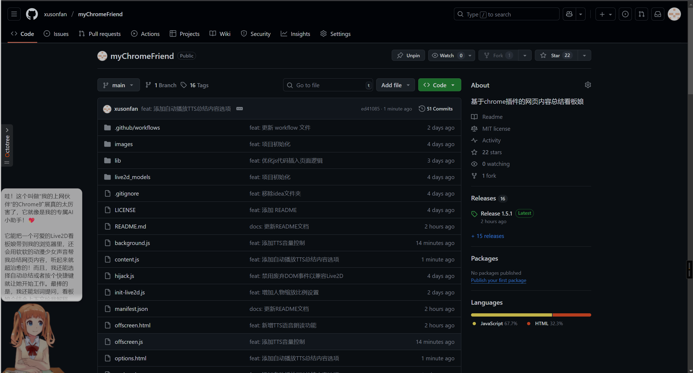
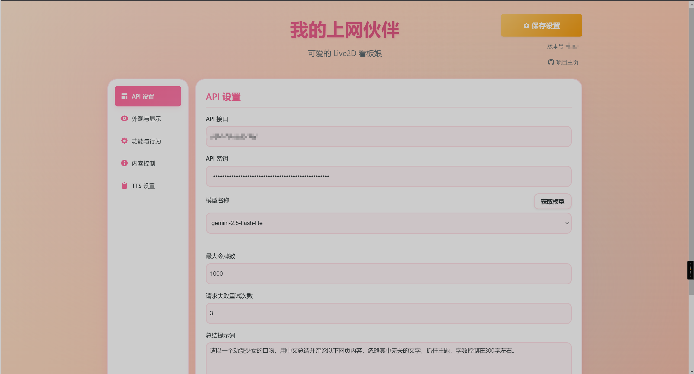
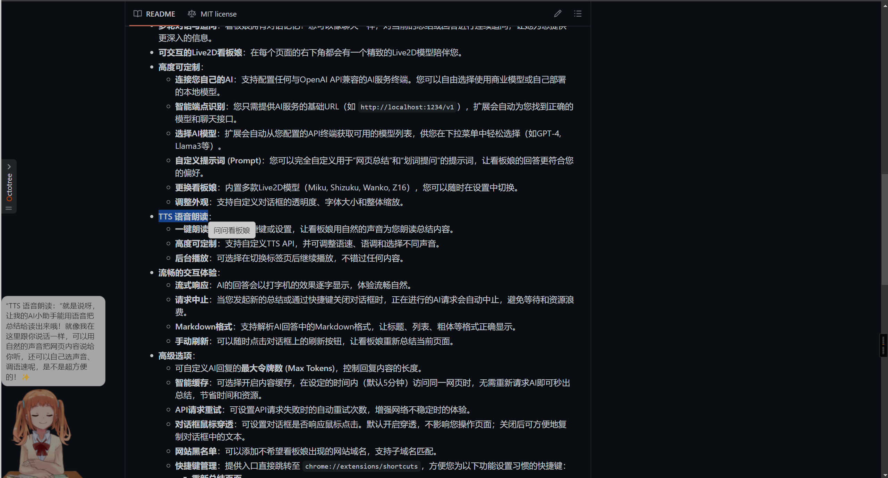

# 我的上网伙伴 (My Chrome Friend)

这是一个功能强大的Chrome浏览器扩展，它将一个可爱的Live2D看板娘带到您的浏览器中，并集成了AI大语言模型，让她成为您在网上冲浪时的智能伙伴。

## ✨ 主要功能

*   **AI网页总结**：在您浏览任何网页时，看板娘会自动阅读页面内容，并以可爱的动漫少女口吻为您提供一个简洁、有趣的总结。
    *   **自动/手动模式**：可在设置中选择页面加载后自动总结，或仅通过快捷键手动触发。
*   **划词提问**：在页面上选中任意文本，即可召唤“问问看板娘”按钮。点击后，看板娘会结合上下文，为您解释选中的内容。
*   **多轮对话与追问**：看板娘拥有对话记忆！您可以像聊天一样，对当前的总结或回答进行连续追问，让她为您提供更深入的信息。
*   **可交互的Live2D看板娘**：在每个页面的右下角都会有一个精致的Live2D模型陪伴您。
*   **高度可定制**：
    *   **连接您自己的AI**：支持配置任何与OpenAI API兼容的AI服务终端。您可以自由选择使用商业模型或自己部署的本地模型。
    *   **智能端点识别**：您只需提供AI服务的基础URL（如 `http://localhost:1234/v1`），扩展会自动为您找到正确的模型和聊天接口。
    *   **选择AI模型**：扩展会自动从您配置的API终端获取可用的模型列表，供您在下拉菜单中轻松选择（如GPT-4, Llama3等）。
    *   **自定义提示词 (Prompt)**：您可以完全自定义用于“网页总结”和“划词提问”的提示词，让看板娘的回答更符合您的偏好。
    *   **更换看板娘**：内置多款Live2D模型（Miku, Shizuku, Wanko, Z16），您可以随时在设置中切换。
    *   **调整外观**：支持自定义对话框的透明度、字体大小和整体缩放。
*   **TTS 语音朗读**：
    *   **一键朗读**：可通过快捷键或设置，让看板娘用自然的声音为您朗读总结内容。
    *   **高度可定制**：支持自定义TTS API，并可调整语速、语调和选择不同声音。
    *   **后台播放**：可选择在切换标签页后继续播放，不错过任何内容。
*   **流畅的交互体验**：
    *   **流式响应**：AI的回答会以打字机的效果逐字显示，体验流畅自然。
    *   **请求中止**：当您发起新的总结或通过快捷键关闭对话框时，正在进行的AI请求会自动中止，避免等待和资源浪费。
    *   **Markdown格式**：支持解析AI回答中的Markdown格式，让标题、列表、粗体等格式正确显示。
    *   **手动刷新**：可以随时点击对话框上的刷新按钮，让看板娘重新总结当前页面。
*   **高级选项**：
    *   可自定义AI回复的**最大令牌数 (Max Tokens)**，控制回复内容的长度。
    *   **智能缓存**：可选择开启内容缓存，在设定的时间内（默认5分钟）访问同一网页时，无需重新请求AI即可秒出总结，节省时间和资源。
    *   **API请求重试**：可设置API请求失败时的自动重试次数，增强网络不稳定时的体验。
    *   **对话框鼠标穿透**：可设置对话框是否响应鼠标点击。默认开启穿透，不影响您操作页面；关闭后可方便地复制对话框中的文本。
    *   **网站黑名单**：可以添加不希望看板娘出现的网站域名，支持子域名匹配。
    *   **快捷键管理**：提供入口直接跳转至 `chrome://extensions/shortcuts`，方便您为以下功能设置习惯的快捷键：
        *   **重新总结页面**
        *   **关闭并终止对话**
        *   **切换对话框可见性**
        *   **展开追问输入框**
        *   **播放或停止TTS语音**

## 🚀 安装与配置

### 安装步骤

1.  下载或克隆此仓库到您的本地计算机。
2.  打开Chrome浏览器，在地址栏输入 `chrome://extensions/` 并回车。
3.  在页面右上角，打开 **“开发者模式”** 的开关。
4.  点击左上角的 **“加载已解压的扩展程序”** 按钮。
5.  在弹出的文件选择框中，选择您刚刚下载或克隆的项目文件夹。

### 首次配置

1.  安装成功后，点击浏览器工具栏上的“我的上网伙伴”图标。
2.  在弹出的设置页面中，展开 **“API 设置”**，填入以下信息：
    *   **API 接口**：您的AI服务的URL。扩展很智能，它会自动处理路径，您只需填写基础路径即可（如 `https://api.openai.com/v1` 或 `http://127.0.0.1:8080/v1` 甚至 `http://localhost:1234`）。
    *   **API 密钥**：您的AI服务所需的密钥。
3.  点击 **“获取”** 按钮，扩展会自动拉取所有可用的AI模型。
4.  从 **“模型名称”** 下拉菜单中选择您想使用的模型。
5.  （可选）根据您的喜好修改以下设置：
    *   **提示词**：用于生成网页总结的系统级指令。
    *   **最大令牌数**：限制AI生成内容的最大长度。
    *   **选择人物**：选择您喜欢的Live2D角色。
    *   **对话框透明度**：通过滑块调整对话气泡的背景透明度。
    *   **对话框字体大小**：通过滑块调整对话内容的字体大小。
    *   **整体缩放**：调整看板娘和对话框的整体大小。
    *   **自动总结**：勾选此项可在页面加载后自动进行总结。取消勾选后，只能通过快捷键触发。
    *   **启用划词提问**：勾选此项以启用划词解释功能。
    *   **划词提问提示词**：自定义划词提问的指令。您可以使用 `{selection}` 代表选中的文本，`{context}` 代表网页全文。
    *   **启用追问功能**：勾选此项以开启多轮对话功能。
6.  点击 **“保存”** 按钮。如果设置有变化，扩展会保存并自动刷新当前页面以应用新配置；如果设置未变，则会提示您无需保存。
7.  （可选）高级设置：
    *   **API请求重试次数**：设置网络请求失败时自动重试的次数。
    *   **启用内容缓存**：勾选后，可在下方设置缓存的有效时间（分钟）。
    *   **禁用鼠标穿透**：勾选后，对话框将不再具备鼠标穿透功能，方便您复制内容。
    *   **快捷键**：点击“管理快捷键”按钮，会打开Chrome的快捷键设置页面，您可以在此为“我的上网伙伴”分配快捷键。
    *   **网址黑名单**：在输入框中填入您不希望此扩展运行的网站域名，每行一个。支持主域名和子域名。
    *   **TTS语音朗读**：在这里配置TTS功能，包括开关、API接口、声音选择、语速语调等。

配置完成后，打开任何网页，您的上网伙伴就会出现并开始工作了！

## 📝 许可证

本项目基于 [MIT](LICENSE) 许可证开源。